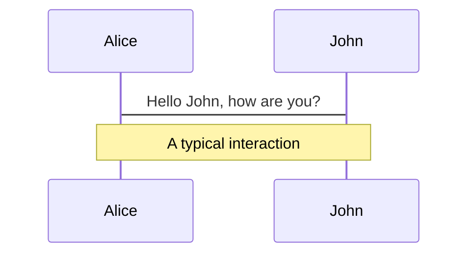
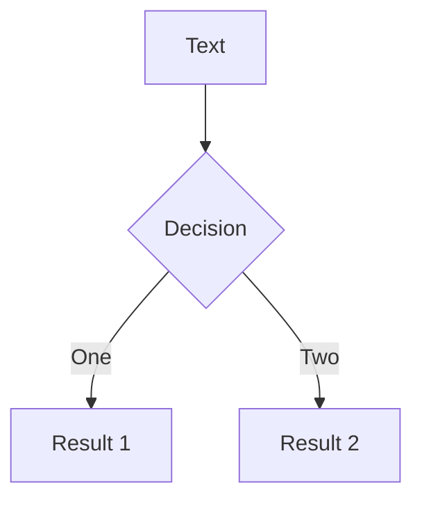
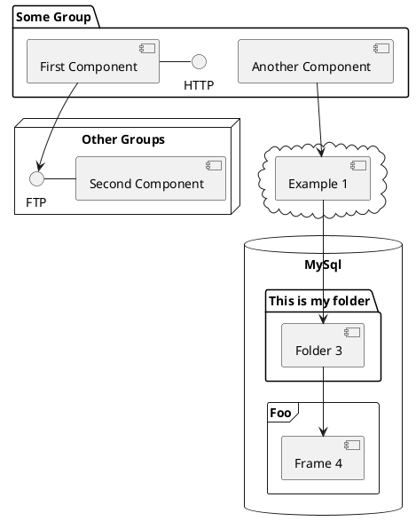

---
# try also 'default' to start simple
theme: seriph
# random image from a curated Unsplash collection by Anthony
# like them? see https://unsplash.com/collections/94734566/slidev
background: https://source.unsplash.com/collection/94734566/1920x1080
# apply any windi css classes to the current slide
class: 'text-center'
# https://sli.dev/custom/highlighters.html
highlighter: shiki
# show line numbers in code blocks
lineNumbers: false
# some information about the slides, markdown enabled
info: |
  ## Slidev Starter Template
  Presentation slides for developers.

  Learn more at [Sli.dev](https://sli.dev)
# persist drawings in exports and build
drawings:
  persist: false
# page transition
transition: slide-left
# use UnoCSS
css: unocss
---

# 玩转Kotlin协程

分享人：罗广荣

<div class="pt-12">
  <span @click="$slidev.nav.next" class="px-2 py-1 rounded cursor-pointer" hover="bg-white bg-opacity-10">
    Next <carbon:arrow-right class="inline"/>
  </span>
</div>

<div class="abs-br m-6 flex gap-2">
  <a href="https://github.com/kevinroy-lo/MampodKotlinShare" target="_blank" alt="GitHub"
    class="text-xl slidev-icon-btn opacity-50 !border-none !hover:text-white">
    <carbon-logo-github />
  </a>
</div>

<!--
这里备注：可以在播放的时候准备好讲述词

-->

---
transition: fade-out
---

# 一、快速入门
### 协程是什么？
<br>

> wiki：Coroutines are computer program components that allow execution to be suspended and resumed, generalizing subroutines for cooperative multitasking. Coroutines are well-suited for implementing familiar program components such as cooperative tasks, exceptions, event loops, iterators, infinite lists and pipes.

<br>

>协同程序是允许暂停和恢复执行的计算机程序组件，概括了用于协作多任务处理的子程序。 协程非常适合实现熟悉的程序组件，例如协作任务、异常、事件循环、迭代器、无限列表和管道。

<br/>
简单来说：

- 协程是一种**非抢占式或者说协作式**的计算机程序并发调度的实现，程序可以主动挂起或者恢复执行。


<!-- - 📝 **Text-based** - focus on the content with Markdown, and then style them later
- 🎨 **Themable** - theme can be shared and used with npm packages
- 🧑‍💻 **Developer Friendly** - code highlighting, live coding with autocompletion
- 🤹 **Interactive** - embedding Vue components to enhance your expressions
- 🎥 **Recording** - built-in recording and camera view
- 📤 **Portable** - export into PDF, PNGs, or even a hostable SPA
- 🛠 **Hackable** - anything possible on a webpage -->

<br>
<br>

Read more about [Kotlin Coroutine?](https://en.wikipedia.org/wiki/Coroutine)

<!--
You can have `style` tag in markdown to override the style for the current page.
Learn more: https://sli.dev/guide/syntax#embedded-styles
-->

<style>
h1 {
  background-color: #2B90B6;
  background-image: linear-gradient(45deg, #4EC5D4 10%, #146b8c 20%);
  background-size: 100%;
  -webkit-background-clip: text;
  -moz-background-clip: text;
  -webkit-text-fill-color: transparent;
  -moz-text-fill-color: transparent;
}
</style>

<!--
Here is another comment.
-->

---
transition: slide-up
---
### 协程的启动方式(1)
1、runBlocking{} (runBlocking启动的协程任务会阻断当前线程，直到该协程执行结束)
<v-click>

```kotlin {2|all}
fun main() {
    runBlocking {
        println("running in ：${Thread.currentThread().name}")
        delay(1000)
    }
    println("running in ：${Thread.currentThread().name}")
}
// running in ：main
// running in ：main
```
</v-click>

2、GlobalScope.launch{}
<v-after>

```kotlin {1|2|all}
fun main() = runBlocking {
    launch {
        delay(600)
        println("running in ：${Thread.currentThread().name}")
    }.join()
    println("running in ：${Thread.currentThread().name}")
}
// running in ：DefaultDispatcher-worker-1
// running in ：main
```
</v-after>

---
transition: slide-up
---
### 协程的启动方式(2)

3、async/await

<v-after>

```kotlin {2|all}
fun main() = runBlocking {
    val job = async {
        println("start -> ${Thread.currentThread().name}")
    }
    job.await()
    println("start -> ${Thread.currentThread().name}")
}
// start -> main
// start -> main
```
</v-after>
---


### 协程启动模式
<br>

启动协程需要三样东西，分别是 **上下文、启动模式、协程体**，以launch为例，介绍一下协程的启动模式


```kotlin {3}
public fun CoroutineScope.launch(
    context: CoroutineContext = EmptyCoroutineContext,
    start: CoroutineStart = CoroutineStart.DEFAULT, // 启动模式
    block: suspend CoroutineScope.() -> Unit
): Job
```
<br>

- 🎨 **DEFAULT** - *立即执行协程体*
- 🧑 **LAZY**    -  *只有在有必要的情况下才执行协程体*
- 🤹 **ATOMIC**  - *立即执行协程体，但在开始运行之前无法取消*
- 🎥 **UNDISPATCHED** - *立即在当前线程执行协程体，直到第一个suspend调用*


---

### 协程启动模式 - DEFAULT
<br>
```kotlin
suspend fun main() {
    log(1)
    val job = GlobalScope.launch {
        log(2)
    }
    log(3)
    job.join()
    log(4)
}
// 14:18:05:453 [main] 1
// 14:18:05:467 [main] 3
// 14:18:05:467 [DefaultDispatcher-worker-1] 2
// 14:18:05:471 [main] 4
```

- 由前面我们知道，默认的模式为DEFAULT，在JVM后台，有专门的线程池去执行任务
- 2 和 3 的输出先后顺序是不确定的

---

### 协程启动模式 - LAZY

> LAZY 是懒汉式启动，launch 后并不会有任何调度行为，协程体也不会进入执行状态，直到我们需要它执行的时候。
```kotlin
suspend fun main() {
    log(1)
    val job = GlobalScope.launch(start = CoroutineStart.LAZY) {
        log(2)
    }
    log(3)
    job.start()
    log(4)
}
// 14:56:28:374 [main] 1
// 14:56:28:493 [main] 3
// 14:56:28:511 [main] 4
// 14:56:28:516 [DefaultDispatcher-worker-1] 2

```

对于LAZY，有2种方法可以触发协程体执行
- 调用 Job.start，主动触发协程的调度执行
  - 例子中，1，3的顺序是确定的，**2，4将不确定**
- 调用 Job.join，隐式的触发协程的调度执行
  - **2，4是确定的**，join方法会挂起当前协程，直到job完成

---

### 协程启动模式 - ATOMIC

> ATOMIC 只有涉及 cancel 的时候才有意义,在到达第一个挂起点前，不会检查是否取消
```kotlin
suspend fun main() {
    log(1)
    val job = GlobalScope.launch(start = CoroutineStart.ATOMIC) {
        log(2)  
        delay(1000)
        log(3)
    }
    job.cancel()
    log(4)
    job.join()
}
```
<br/>
注意：

- 在DEFAULT下，由于cancel，可能协程被取消不会打印。输出：1、（2）、4
- 但在ATOMIC模式下，一定会执行。输出：1、2、4（**non-cancellable way**）

---

### 协程启动模式 - UNDISPATCHED

> 协程在这种模式下会直接开始**在当前线程下执行，直到第一个挂起点**，这听起来有点儿像前面的 ATOMIC，不同之**处在于 UNDISPATCHED 不经过任何调度器即开始执行协程体**。
```kotlin
suspend fun main() {
    log(1)
    val job = GlobalScope.launch(start = CoroutineStart.UNDISPATCHED) {
        log(2)
        delay(100)
        log(3)
    }
    log(4)
    job.join()
    log(5)
}
// 14:57:53:331 [main] 1
// 14:57:53:361 [main] 2
// 14:57:53:369 [main] 4
// 14:57:53:484 [DefaultDispatcher-worker-1] 3
// 14:57:53:486 [DefaultDispatcher-worker-1] 5
```
<br/>

<p class="think">想一想，在job执行完后，3和5的打印为什么在同一线程中？</p>

<style>
.think{
  font-size:22px;
  color:red;
}
</style>


---
layout: two-cols
---

## 解惑
<p class="think">3和5的打印为什么在同一线程中？</p>

```kotlin
suspend fun main() {
    log(1)
    val job = GlobalScope.launch(start = CoroutineStart.UNDISPATCHED) {
        log(2)
        delay(100)
        log(3)
    }
    log(4)
    job.join()
    log(5)
}
// 14:57:53:331 [main] 1
// 14:57:53:361 [main] 2
// 14:57:53:369 [main] 4
// 14:57:53:484 [DefaultDispatcher-worker-1] 3
// 14:57:53:486 [DefaultDispatcher-worker-1] 5
```

::right::


## RunSuspend

<p  class="think" >1</p>

```kotlin
private class RunSuspend : Continuation<Unit> {
    override val context: CoroutineContext get() = EmptyCoroutineContext
    var result: Result<Unit>? = null
    override fun resumeWith(result: Result<Unit>) = synchronized(this) {
        this.result = result
        @Suppress("PLATFORM_CLASS_MAPPED_TO_KOTLIN") (this as Object).notifyAll()
    }
    // ...
} 
```

**由于runBlocking这种启动方式，并没有设置调度器，会在最后调试的线程中恢复过来**


<style>
.think{
  font-size:22px;
  color:red;
}
</style>


---

## 协程调度器（Dispatchers）

<br>

> 上下文的子类，同时实现了拦截器的接口， dispatch 方法会在拦截器的方法 interceptContinuation 中调用，进而实现协程的调度。

- 🎈Default       --  **线程池**
- 🎄Main          --  **UI线程（Android）**
- 🎭Unconfined    --  **直接执行(在启动协程中执行)**
- ✨IO            --  **线程池**

<br>

IO 仅在 Jvm 上有定义，它基于 Default 调度器背后的线程池，并实现了独立的队列和限制，因此协程调度器从 Default 切换到 IO 并不会触发线程切换。


---
layout: two-cols
---
## 调度节点

```kotlin
suspend fun main() {
    GlobalScope.launch(MyContinuationInterceptor()) {
        log(1)
        val job = async {
            log(2)
            delay(1000)
            log(3)
            "Hello"
        }
        log(4)
        val result = job.await()
        log("5. $result")
    }.join()
    log(6)
}
// 15:31:55:989 [main] <MyContinuation> Success(kotlin.Unit)  // ①
// 15:31:55:992 [main] 1
// 15:31:56:000 [main] <MyContinuation> Success(kotlin.Unit) // ②
// 15:31:56:000 [main] 2
// 15:31:56:031 [main] 4
// 15:31:57:029 [kotlinx.coroutines.DefaultExecutor] <MyContinuation> Success(kotlin.Unit) // ③
// 15:31:57:029 [kotlinx.coroutines.DefaultExecutor] 3
// 15:31:57:031 [kotlinx.coroutines.DefaultExecutor] <MyContinuation> Success(Hello) // ④
// 15:31:57:031 [kotlinx.coroutines.DefaultExecutor] 5. Hello
// 15:31:57:031 [kotlinx.coroutines.DefaultExecutor] 6
```

::right::

<br>

**右边的例子中，调度器回调了4次**
- 1、刚启动时，会被调度一次,launch、async.
- 2、如上
- 3、delay 是挂起点，1000ms 之后需要继续调度执行该协程，调度器调度到这个线程
- 4、返回结果时

<br>

**🧐思考：**

- 这里要注意的一个点是，2为什么在4的前面输出？
- 如果给 async 指定了调度器，又会是什么情形？

Read more about [Kotlin Dispatchers?](https://www.bennyhuo.com/2019/04/11/coroutine-dispatchers/)


---

# 示例其他代码


```kotlin

val dateFormat = SimpleDateFormat("HH:mm:ss:SSS")
val now = {
    dateFormat.format(Date(System.currentTimeMillis()))
}
fun log(msg: Any?) = println("${now()} [${Thread.currentThread().name}] $msg")

class MyContinuationInterceptor: ContinuationInterceptor {
    override val key = ContinuationInterceptor
    override fun <T> interceptContinuation(continuation: Continuation<T>) = MyContinuation(continuation)
}

class MyContinuation<T>(val continuation: Continuation<T>): Continuation<T> {
    override val context = continuation.context
    override fun resumeWith(result: Result<T>) {
        log("<MyContinuation> $result" )
        continuation.resumeWith(result)
    }
}

```


---

## 协程的异常(Exception)

**结构化并发：**
>每个并发操作其实都是在处理一个单独的任务，这个 任务 中，可能还存在 子任务 ; 同样对于这个子任务来说，它又是其父任务的子单元。每个任务都有自己的生命周期，子任务的生命周期会继承父任务的生命周期，比如如果父任务关闭，子任务也会被取消。而如果满足这样特性，我们就称其就是 **结构化并发。**

<br>

**异常传播形式**

在协程中，异常的传播形式有两种
- 🎈一种是自动传播( launch 或 actor)，传递过程是层层向上传递(如果异常没有被捕获)
- 🎍一种是向用户暴漏该异常( async 或 produce )，将不会向上传递，会在调用处直接暴漏


---

## 协程的异常(Exception) 1


**异常处理方式**

在协程中，异常的处理方式两种
- 🎈tryCatch
- 🎍CoroutineExceptionHandler

**使用：**

```kotlin
val handler = CoroutineExceptionHandler { _, it -> log("handler exception happen:$it") }
scope.launch(handler1){}
```

**🧐思考** 可以try-catch住吗？
```kotlin
    try {
        CoroutineScope(EmptyCoroutineContext).launch {
            throw RuntimeException()
        }.join()
    } catch (e: Exception) {
        log("catch exception :$e")
    }
```

---

## 异常 - 自动传播

<br/>

```kotlin
Thread.setDefaultUncaughtExceptionHandler { thread, throwable -> log("java exception happen:${throwable}") }
val scope = CoroutineScope(EmptyCoroutineContext + handler2)
scope.launch(/*handler1*/) {
    launch(handler) {
        delay(10)
        log(1)
        throw RuntimeException()
    }
    launch() {
        delay(100)
        log("无论怎样，我都被取消了😭")
    }
}.join()
log(2)
```

**结论：**

- 由于协程的异常传播路径为为 handler1（根协程）> handler2(根协程域) > Java处理
- 由于异常产生，其他子协程和兄弟协程都被取消了


<!--因为向上传播的属性， handler 始终不会被调用到

 由于发生异常，导致协程域内的子协程都被取消 -->


---
layout: two-cols
---

##  异常- SupervisorJob vs Job


```kotlin
val scope = CoroutineScope(handler3 + SupervisorJob()/*3*/)/*根协程域*/
val job1 = scope.launch(handler2 /*+ SupervisorJob()*//*2*/) {/*根协程*/
    launch(handler1 /*+ SupervisorJob()*//*1*/) {
        launch(handler/* + SupervisorJob()*//*0*/) {
            delay(10)
            throw RuntimeException()
        }
        launch() {
            delay(100)
            log("正常执行2,我不会受到影响")
        }
    }
    launch() {
        delay(200)
        log("正常执行3,我不会受到影响")
    }
}
val job3 = scope.launch(CoroutineName("B")/*3*/) {
    delay(300)
    log("正常执行4,我不会受到影响")
}
joinAll(job1, job3)
```

::right::

<br/>

  **如上，0的协程里将抛出异常：**


- 🎄发生异常时，CoroutineExceptionHandler的处理优先级是，向上传播，SupervisorJob -> 根协程 -> 根协程域
- 🎋普通Job，会导致整个协程域的协程都被取消。SupervisorJob会限制在其内的子协程，不会影响兄弟协程。
- 🎍如果在初始化 scope 时添加了 SupervisorJob ,那么整个scope对应的所有 根协程 都将默认携带 SupervisorJob，对应4和5的情况。


<!-- 1、如果0、1、2、3处都不加SupervisorJob，则异常会交由根协程处理。整个协程域都的协程都被取消。

2、给0处加了SupervisorJob，交由自己handler处理，正常执行2、3、4

3、给1处加了SupervisorJob，交由自己handler1处理，正常执行3、4。 0的兄弟协程1被取消。

4、给2处加了SupervisorJob，交由自己handler2处理，正常执行4。    2下的子协程都被取消。4不受影响。

5、给3处加了SupervisorJob，交由自己handler2处理，正常执行4。    2下的子协程都被取消。4不受影响。

6、2、3处都不加SupervisorJob，2下的子协程、4的兄弟协程都被取消 -->


---

# 线程 vs 协程


<!-- https://sli.dev/guide/animations.html#click-animations -->

<p v-after class="absolute bottom-23 left-45 opacity-30 transform -rotate-10">Here!</p>


---
layout: image-right
image: https://source.unsplash.com/collection/94734566/1920x1080
---

# Code

Use code snippets and get the highlighting directly![^1]

```ts {all|2|1-6|9|all}
interface User {
  id: number
  firstName: string
  lastName: string
  role: string
}

function updateUser(id: number, update: User) {
  const user = getUser(id)
  const newUser = { ...user, ...update }
  saveUser(id, newUser)
}
```

<arrow v-click="3" x1="400" y1="420" x2="230" y2="330" color="#564" width="3" arrowSize="1" />

[^1]: [Learn More](https://sli.dev/guide/syntax.html#line-highlighting)

<style>
.footnotes-sep {
  @apply mt-20 opacity-10;
}
.footnotes {
  @apply text-sm opacity-75;
}
.footnote-backref {
  display: none;
}
</style>

---

# Components

<div grid="~ cols-2 gap-4">
<div>

You can use Vue components directly inside your slides.

We have provided a few built-in components like `<Tweet/>` and `<Youtube/>` that you can use directly. And adding your custom components is also super easy.

```html
<Counter :count="10" />
```

<!-- ./components/Counter.vue -->
<Counter :count="10" m="t-4" />

Check out [the guides](https://sli.dev/builtin/components.html) for more.

</div>
<div>

```html
<Tweet id="1390115482657726468" />
```

<Tweet id="1390115482657726468" scale="0.65" />

</div>
</div>

<!--
Presenter note with **bold**, *italic*, and ~~striked~~ text.

Also, HTML elements are valid:
<div class="flex w-full">
  <span style="flex-grow: 1;">Left content</span>
  <span>Right content</span>
</div>
-->


---
class: px-20
---

# Themes

Slidev comes with powerful theming support. Themes can provide styles, layouts, components, or even configurations for tools. Switching between themes by just **one edit** in your frontmatter:

<div grid="~ cols-2 gap-2" m="-t-2">

```yaml
---
theme: default
---
```

```yaml
---
theme: seriph
---
```


</div>

Read more about [How to use a theme](https://sli.dev/themes/use.html) and
check out the [Awesome Themes Gallery](https://sli.dev/themes/gallery.html).

---
preload: false
---

# Animations

Animations are powered by [@vueuse/motion](https://motion.vueuse.org/).

```html
<div
  v-motion
  :initial="{ x: -80 }"
  :enter="{ x: 0 }">
  Slidev
</div>
```

<div class="w-60 relative mt-6">
  <div class="relative w-40 h-40">
    
    
    
  </div>

  <div
    class="text-5xl absolute top-14 left-40 text-[#2B90B6] -z-1"
    v-motion
    :initial="{ x: -80, opacity: 0}"
    :enter="{ x: 0, opacity: 1, transition: { delay: 2000, duration: 1000 } }">
    Slidev
  </div>
</div>

<!-- vue script setup scripts can be directly used in markdown, and will only affects current page -->
<script setup lang="ts">
const final = {
  x: 0,
  y: 0,
  rotate: 0,
  scale: 1,
  transition: {
    type: 'spring',
    damping: 10,
    stiffness: 20,
    mass: 2
  }
}
</script>

<div
  v-motion
  :initial="{ x:35, y: 40, opacity: 0}"
  :enter="{ y: 0, opacity: 1, transition: { delay: 3500 } }">

[Learn More](https://sli.dev/guide/animations.html#motion)

</div>

---

# LaTeX

LaTeX is supported out-of-box powered by [KaTeX](https://katex.org/).

<br>

Inline $\sqrt{3x-1}+(1+x)^2$

Block
$$
\begin{array}{c}

\nabla \times \vec{\mathbf{B}} -\, \frac1c\, \frac{\partial\vec{\mathbf{E}}}{\partial t} &
= \frac{4\pi}{c}\vec{\mathbf{j}}    \nabla \cdot \vec{\mathbf{E}} & = 4 \pi \rho \\

\nabla \times \vec{\mathbf{E}}\, +\, \frac1c\, \frac{\partial\vec{\mathbf{B}}}{\partial t} & = \vec{\mathbf{0}} \\

\nabla \cdot \vec{\mathbf{B}} & = 0

\end{array}
$$

<br>

[Learn more](https://sli.dev/guide/syntax#latex)

---

# Diagrams

You can create diagrams / graphs from textual descriptions, directly in your Markdown.

<div class="grid grid-cols-3 gap-10 pt-4 -mb-6">







</div>

[Learn More](https://sli.dev/guide/syntax.html#diagrams)

---
src: ./pages/multiple-entries.md
hide: false
---

---
layout: center
class: text-center
---

# Learn More

[Documentations](https://sli.dev) · [GitHub](https://github.com/slidevjs/slidev) · [Showcases](https://sli.dev/showcases.html)
